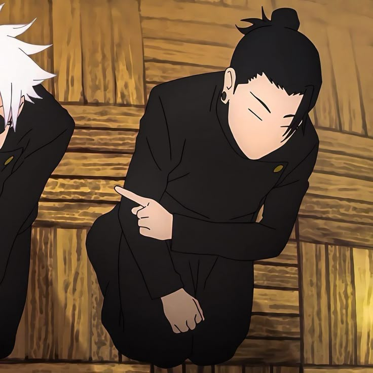

<p align="center">
  <picture>
    <source media="(prefers-color-scheme: dark)" srcset="./pixel-banner-dark.gif">
    
  </picture>
</p>

<h1 align="center"> Hello, I'm <strong>Arkan</strong> — Fullstack Developer</h1>
<p align="center"><em>Student  | Code  | Sports  | Pets  | Games</em></p>

<p align="center">
  
</p>


<p align="center">
  
  
  
  
  
  
  
  
  
</p>

---

### 🧠 About Me
- 🔭 Currently working on cool fullstack web apps  
- 🧪 Exploring Rust + Godot for game dev  
- 🎨 Designing pixel-art and UIs that feel like retro consoles  
- 🕹️ I also create **mini browser games** as side projects!

---
### 📊 GitHub Stats
<p align="center">
  <a href="https://github.com/Shibarkan">
    
  </a>
</p>

---

### My Contact
<p align="center">
  
  
  
</p>


<p align="center"> <a href="https://github.com/Shibarkan"></a> <a href="https://linkedin.com/in/yourprofile"></a> <a href="shibarkan01@gmail.com"></a> </p> 

```diff
+ 🔋 Energy: 100%
! ⚡ Next‑Level Goal: Master Rust & Godot
- ❌ Offline mode: Not an option.


